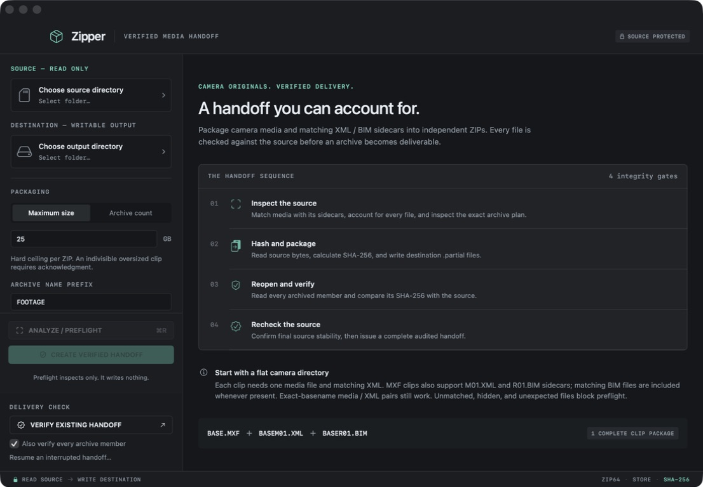

# Zipper

A native macOS app for preparing camera-media deliveries as independently extractable ZIP archives. Zipper keeps each media file and its sidecars together, preserves their bytes and filenames, and verifies the delivery with SHA-256.

**Swift + SwiftUI · ZIP64 · STORE · Local processing**



## What it does

- Packages a flat folder of media and XML/BIM sidecars into independent ZIPs.
- Supports a maximum archive size or an exact archive count; complete clip packages stay together.
- Performs preflight without writing to either the source or destination.
- Hashes every source file, independently reads back every archived member, hashes each ZIP, and rehashes the source before completing the handoff.
- Preserves verified archives and recoverable state when a job stops.
- Checks an existing delivery without requiring the original media or extracting the ZIPs.

Zipper packages file contents. It does not validate picture/audio quality, reconstruct a complete camera card, or replace the original offload and backup workflow.

## Build and run

Requirements:

- macOS 14 or later. The qualified build is Apple Silicon; other hardware and macOS versions require validation.
- Xcode or Xcode Command Line Tools providing **Swift 6 or later**.
- A writable local APFS destination for handoff creation.

```sh
git clone https://github.com/lolusername/zipper.git
cd zipper
./scripts/package.sh
open build/Zipper.app
```

The repository contains source code, not a prebuilt application. Packaging creates `build/Zipper.app`; it does not install the app in `/Applications`.

Quit Zipper before rebuilding. The packaging script builds, signs, and verifies a separate bundle, then publishes it atomically. It blocks concurrent packaging and replacement of a running app. Failed builds preserve the previous application.

The local build is ad-hoc signed with the hardened runtime. It is not a notarized distribution release. Redistribution requires appropriate Developer ID signing and notarization. The app uses macOS system libraries, including libarchive, zlib, CryptoKit, and SwiftUI; no Homebrew or Python runtime or network service is required.

## Create a verified handoff

1. **Create an empty delivery folder in Finder first**, outside the source folder, on a writable APFS volume. Zipper’s folder pickers select existing folders.
2. Select **SOURCE — READ ONLY** and **DESTINATION — WRITABLE OUTPUT** separately.
3. Choose a maximum ZIP size in decimal GB or an exact number of archives, and set the archive-name prefix.
4. Click **Analyze / Preflight**. Inspect file counts, sidecar matches, capacity, warnings, and the planned contents of every archive. Preflight writes nothing.
5. Resolve blocking issues. If an indivisible clip package exceeds the maximum, explicitly acknowledge its oversized archive before continuing.
6. Click **Create Verified Handoff**. Wait for **VERIFIED HANDOFF READY**; finishing the write phase alone is not completion.

Source and destination must not overlap. Existing output names block a new job; Zipper does not silently overwrite a delivery. Unknown, hidden, nested, ambiguous, or unmatched source entries block packaging instead of being omitted.

## Supported clip packages

Exact-basename media/XML pairs are supported:

```text
A001C001.mov
A001C001.xml
```

For MXF clips, Sony-style sidecars are also supported:

```text
CLIP0001.MXF
CLIP0001M01.XML
CLIP0001R01.BIM
```

`CLIP0001` is the media stem. These files form one indivisible package. A matching BIM is included whenever present and receives the same hashing and verification as the media and XML; BIM may be absent. An absent BIM does not, by itself, prove whether a card copy is complete.

`BASER01.BIM` may accompany either `BASE.MXF` + `BASE.XML` or `BASE.MXF` + `BASEM01.XML`. Only the `M01` / `R01` suffixes are supported. Suffixes and extensions may vary in ASCII case; the shared stem must match exactly, including case and Unicode bytes. Bare `BASE.BIM`, other numbered suffixes, competing sidecars, and ambiguous ownership block preflight.

**Selecting `XDROOT/Clip` packages only that flat folder.** Parent metadata, proxies, take/clip-list references, and other card folders are outside the handoff. Retain the complete original card tree separately. See the [Sony structure audit](docs/SONY-STRUCTURE-AUDIT.md).

Supported media extensions are centralized in [`SupportedMedia`](Sources/HandoffCore/ReadOnlySource.swift). Formats that require nested folder trees or multiple media components are outside this workflow. Filesystem permissions, extended attributes, resource forks, and original timestamps are not archive payloads.

## Verify the delivery

You do not need to open every clip or extract every ZIP to check byte integrity.

1. Enable **Also verify every archive member**.
2. Click **Verify Existing Handoff** and select the folder containing the ZIPs and all delivery reports.
3. Require **Handoff verification passed** with **Deep verification** shown, and check the archive/member counts.

Deep verification reads every archived member and compares its SHA-256 and size with the recorded source evidence. It also checks complete ZIP hashes, membership, required reports, and missing or unexpected archives. With the checkbox off, Zipper checks archive hashes and reports without reading individual member streams. Neither mode writes to the delivery or requires the source card.

For an independent check of every complete ZIP, run this inside the delivery folder:

```sh
shasum -a 256 -c SHA256SUMS.txt
```

Every ZIP must report `OK`. To test one archive’s extraction/CRC integrity with the system ZIP reader:

```sh
unzip -t FOOTAGE_001.zip
```

After copying or downloading the delivery, verify the copy at its final location. Keep the reports with the ZIPs. Checksums establish agreement with the supplied evidence; they are not a digital signature. Retain a trusted copy of the manifest/checksums separately when authenticity matters.

**Byte integrity and playback quality are separate checks.** Matching hashes cannot show that the original recording was free of decoding errors or had the intended picture and audio.

## Delivery contents

```text
FOOTAGE_001.zip
FOOTAGE_002.zip
HANDOFF_MANIFEST.json
HANDOFF_MANIFEST.txt
SHA256SUMS.txt
HANDOFF_LOG.txt
.zipper-job.json
.zipper-job.lock
```

Each ZIP is independently usable. ZIP64 and STORE are unconditional: there are no split-volume archives, transcoding, or compression settings.

A current archive is written as `.FOOTAGE_001.zip.partial`. Only an archive that passes structural checks, independent member verification, and whole-archive hashing receives its final `.zip` name. Overall completion additionally requires final source verification and report publication.

The JSON manifest is the public completion record. Human reports and logs alone are not completion markers. Report publication reads back the intended bytes and rechecks file identities before committing completed JSON. A failure updating only the recovery state after public completion is displayed as a warning.

## Volumes and source protection

| Location | Supported policy |
| --- | --- |
| Source on local APFS | Readable source; mid-job changes cause failure |
| Source on local FAT/FAT32, exFAT, or HFS+ | Must be mounted read-only by macOS |
| Creation or report-export destination | Writable local APFS |
| Existing delivery on FAT/FAT32, exFAT, or HFS+ | Verification requires an OS read-only mount |
| Network or unknown filesystems | Blocked |

Changing permissions with `chmod` does not satisfy the read-only mount requirement. Zipper does not mount, reformat, or alter volumes. The [filesystem audit](docs/qa/safety-reaudit/README.md) explains why writable filesystems with insufficient timestamp precision are restricted.

All production source access passes through a read-only abstraction. The app has no original-file deletion, movement, renaming, or erase controls. This is a code boundary, not an OS-enforced sandbox; use hardware write protection or an OS read-only mount when an independent protection boundary is required. Reading may cause filesystem-managed access-time updates.

A handoff on the same physical device as the originals is not a separate-device backup. Different filesystem identities also do not establish physically independent drives.

## Cancellation and recovery

**Cancel Job** stops at an I/O boundary. Verified ZIPs remain, incomplete output stays marked `.partial`, and persisted state remains non-complete. Normal Quit requests cancellation and waits for the worker to stop.

Use **Resume Verified Handoff** on the original destination after interruption. Recovery revalidates the state under its lock, checks source/destination directory identities, rehashes the source, and rehashes and deeply verifies existing archives. Reconnected drives are not trusted merely because their names match.

A verified partial can be recovered after its evidence is checked. Other interrupted partials and pending report/state files are retained under unique names before rebuilding. Verified ZIPs are never automatically deleted or overwritten. If the original identity cannot be restored, use a fresh destination and a new analysis.

Report export requires all known original-source locations to remain identifiable, so it cannot write into renamed or disconnected originals accidentally. The delivery verification itself remains source-free. State and report files are limited to 64 MiB; preflight blocks inventories whose estimated evidence exceeds that limit.

## Development and validation

```sh
# Core tests; optional large-file and disk-image tests are skipped by default.
swift test

# Complete opt-in suite; uses disposable fixtures and mounted disk images.
ZIPPER_RUN_LARGE_ZIP_TESTS=1 ZIPPER_RUN_FILESYSTEM_TESTS=1 \
ZIPPER_RUN_SOURCE_SAFETY_VOLUME_TESTS=1 \
ZIPPER_RUN_DESTINATION_SAFETY_VOLUME_TESTS=1 swift test

# Disposable packaging failure scenarios.
./scripts/test-package.sh
```

Recorded qualification on **September 7, 2026**:

| Version | Executed evidence |
| --- | --- |
| v1.0.3 | 125 core tests passed with no failures or skips, including a real ZIP over 4 GiB, process-crash recovery, filesystem images, source isolation, and report/recovery fault injection |
| v1.0.3 | Packaged app launched and deeply verified 8 synthetic ZIPs / 281 members |
| v1.0.2 | 72.84 GB of actual footage packaged and independently compared byte-for-byte with the originals; this transfer was not repeated for v1.0.3 |

These are dated results, not a claim that every platform or hardware configuration is qualified. Physical unplug/replug, actual power loss, all USB/Thunderbolt enclosures, supported macOS versions, and full 200 GB–1 TB transfers remain deployment checks. Sparse 200 GB/1 TB planning tests are not complete transfers.

- [Validation evidence](docs/VALIDATION.md)
- [v1.0.3 security and reliability audit](docs/qa/security-devops-audit/README.md)
- [Earlier safety audit and actual-footage qualification](docs/qa/safety-reaudit/README.md)
- [Original requirements](docs/REQUIREMENTS.md)

## Code layout

| Path | Responsibility |
| --- | --- |
| [`Sources/HandoffCore`](Sources/HandoffCore) | Read-only source access, destination guards, grouping, planning, ZIP writing/reading, verification, and recovery |
| [`Sources/ZipperApp`](Sources/ZipperApp) | Native SwiftUI workspace, operator controls, progress, and report export |
| [`Sources/CArchive`](Sources/CArchive) | Vendored public headers for the macOS system libarchive |
| [`Tests/HandoffCoreTests`](Tests/HandoffCoreTests) | Integrity, isolation, filesystem, crash, and recovery regressions |
| [`scripts`](scripts) | Icon generation, atomic app packaging, and packaging tests |
| [`docs`](docs) | Requirements, research, and recorded audit evidence |

The STORE writer is checked by an explicit ZIP64 structural validator and the independent system libarchive reader. Hashing uses streaming CryptoKit SHA-256. Destination writes use identity-checked directory descriptors, no-follow opens, exclusive creation, and atomic promotion. Advisory locks coordinate cooperating Zipper jobs; final checks do not make a delivery immutable against subsequent edits by other software.
